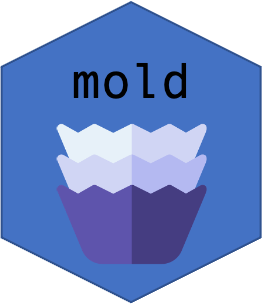

<div>Icons made by <a href="https://www.freepik.com" title="Freepik">Freepik</a> from <a href="https://www.flaticon.com/" title="Flaticon">www.flaticon.com</a></div>

# mold: A Stata Package for a Project Template


## Installation

```
net install github, from("https://haghish.github.io/github/")
github install jaylkim/mold
```


## Recommended workflow

It is natural to change the current working directory to one
under which you want to create your project (parent directory).
Then, run:

```
mold init proj_name, ///
  project("Data analysis") ///
  author("Kim") ///
  stataver(15) ///
  rpath(/usr/local/bin/Rscript) ///
  git
```

This will create a project folder and some subdirectories,
and it changes the working directory to the project folder.

- `data` : Store any datasets (raw or processed)

- `src/R` : R files (_.R_)

- `src/stata` : Stata files (_.do_)

- `doc` : Any documents including R Markdowns

- `ext` : Any external files

- `output/figures` : Save any plots created from the source code

- `output/tables` : Save any tables ready to publish


Also, this will make `_config.do` that defines global macros
for meta data of the project,
and they will be used by other subcommands.


```
mold do do_file_name.do

```

This will make a do-file in `src/stata` with a pre-specified header.
Under the header, some Stata lines will be written.
You can change this template by editing `_template.do` in your project folder.
You might want to add a line for a file path to the data you often use.


After a short break, you want to restart your work.
Then, you just run the `_start_proj_name.do`.
It will set the project folder as the working directory,
and restore the meta data of your project.
It also displays some git information.


## Working with R

You might want to use R between Stata code.
Let say you want to use `gglot` after processing the raw data with Stata.
It is not ideal to save the data on memory, write some R code to read it
and make a plot, and go back to Stata again.

It seems manageable, but it will get complicated if you have to handle
many files for a project.

`mold` provides a command to handle an embedded R code chunk in a do file.

```
sysuse auto, clear

/***
~~~r

library(dplyr)
library(ggplot2)

png("output/figures/plot1.png")

data %>%
  select(mpg, weight) %>%
  ggplot(aes(x = mpg, y = weight)) +
  geom_point()

dev.off()
~~~

***/
mold r, dopath("$CURRENT_DO_PATH")

// Other stata code

```

This code will create a png file in `output/figures` drawn by `ggplot2`.
The global macro `$CURRENT_DO_PATH` will be added by the `mold do` command.
The name `data` is reserved for Stata dataset that will be loaded by R.

This command does the following:


1. Detects an R code chunk before its call and creates an __.R__ file.

2. Saves the data on memory so that the R file can use it.

3. Runs the R file.

4. Prints any side effects other than figures.

5. Saves figures.

6. Returns one data.frame-like object (e.g. _tibble_). 

7. Loads the data on Stata memory.


## Author

Jay (Jongyeon) Kim

Johns Hopkins University


## Bug report

[https://github.com/jaylkim/mold/issues](https://github.com/jaylkim/mold/issues)


## License

MIT License

Copyright (c) 2021 Jongyeon Kim


